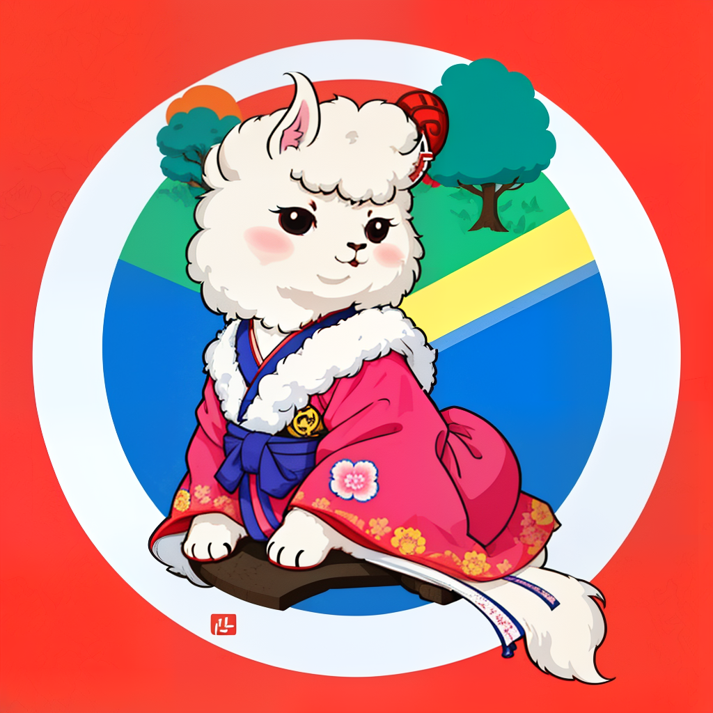

## Update Logs

- 2023.4.20: [🤗LLAMA 7B 기반 KoVicuna 모델](https://huggingface.co/junelee/ko_vicuna_7b) 을 공개합니다.

---

# KoVicuna: Korean Vicuna Model based on Vicuna (feat. Stanford Alpaca)

Vicuna 모델을 학습한 방식과 동일한 방식과 모델셋으로 학습을 진행한, 한국어 Vicuna 모델입니다.

## 데이터셋 제작 방법

데이터셋은 기본적으로 [ShareGPT 제공한 62만 대화문 데이터셋](https://huggingface.co/datasets/anon8231489123/ShareGPT_Vicuna_unfiltered)을 기반으로 합니다.

해당 대화문을 DeepL 을 통해 모두 번역했습니다. [번역본 링크](https://huggingface.co/datasets/junelee/sharegpt_deepl_ko)

## 학습경과

1. 번역된 62만 대화문과 Vicuna 7B 를 준비
2. A100 * 8 개로 15시간 동안 학습 진행
3. 자세한 학습 내역은 이곳을 참고해주세요.

[W B Chart 2023  4  20  오후 3_57_14](https://user-images.githubusercontent.com/21379657/233285808-f6e5514a-107a-4392-ac21-2ea631fce2c2.png)

## 데모
코랩프로일 경우 코랩에서 바로 사용해 보실수 있습니다.

코랩에 들어간후 자세한 가이드를 따라해주세요.

코랩[주소](https://colab.research.google.com/drive/1EOFuhdkE5IjRKaSZOZDwhDicXU1cUE5f?usp=sharing)

## 가중치공개

- 준의 허깅페이스에서 [가중치](https://huggingface.co/junelee/ko_vicuna_7b) 를 확인할 수 있습니다.

## 예시

### Author
- [JUNG LEE](https://github.com/melodysdreamj) - 송도인공지능 스터디에서 활동하고 있습니다.
